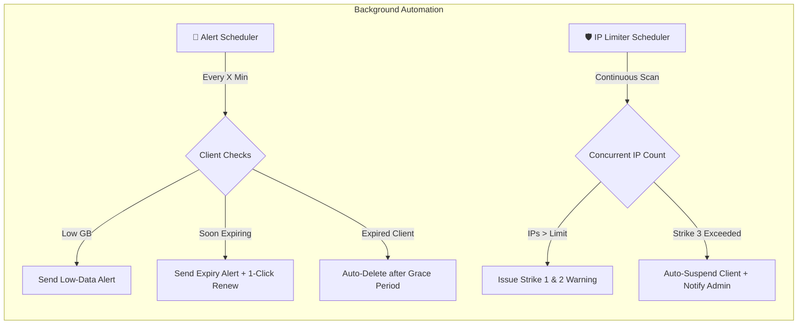

<div align="center">

# 🍭 CandyPop Bot


**An enterprise-grade, fully automated Telegram bot for VPN subscription sales, billing, and client lifecycle management — seamlessly integrated with [3x-ui / X-UI](https://github.com/MHSanaei/3x-ui).**

[](https://python.org)
[](https://aiogram.dev)
[](https://github.com/MHSanaei/3x-ui)
[](https://docker.com)
[](https://sqlite.org)
[](LICENSE.md)
[](.github/workflows/deploy.yml)

> 🚀 **Turn your X-UI panel into a hands-off, 24/7 automated subscription storefront.**  
> Sell subscriptions, manage renewals, verify card receipts, monitor concurrent IP abuse, and configure pricing — entirely from Telegram.

</div>

---

## 📑 Table of Contents

- [🍭 CandyPop Bot](#-candypop-bot)
  - [📑 Table of Contents](#-table-of-contents)
  - [🌟 Highlights](#-highlights)
  - [✨ Features](#-features)
    - [🛒 For Customers (Storefront)](#-for-customers-storefront)
    - [🛡️ For Administrators (Back-Office)](#️-for-administrators-back-office)
    - [🤖 Autonomous Background Schedulers](#-autonomous-background-schedulers)
      - [1. 🔔 Smart Lifecycle Alert Daemon (`alert_scheduler.py`)](#1--smart-lifecycle-alert-daemon-alert_schedulerpy)
      - [2. 🛡️ Multi-Device IP Limiter \& Anti-Abuse (`ip_checker_scheduler.py`)](#2-️-multi-device-ip-limiter--anti-abuse-ip_checker_schedulerpy)
    - [🌍 Localization \& Formatting](#-localization--formatting)
  - [🧱 Project Architecture](#-project-architecture)
  - [⌨️ Bot Commands](#️-bot-commands)
    - [👥 Customer Commands](#-customer-commands)
    - [🛡️ Administrative Commands](#️-administrative-commands)
  - [🚀 Quick Start \& Deployment](#-quick-start--deployment)
    - [📋 Prerequisites](#-prerequisites)
    - [🐳 Method 1: Docker Compose (Recommended)](#-method-1-docker-compose-recommended)
      - [1. Clone the repository](#1-clone-the-repository)
      - [2. Create and configure `.env`](#2-create-and-configure-env)
      - [3. Start the container](#3-start-the-container)
      - [4. Monitor logs](#4-monitor-logs)
      - [Updating the bot:](#updating-the-bot)
    - [⚙️ Method 2: Native Virtualenv + Systemd](#️-method-2-native-virtualenv--systemd)
      - [1. Install system prerequisites](#1-install-system-prerequisites)
      - [2. Clone and prepare environment](#2-clone-and-prepare-environment)
      - [3. Configure environment](#3-configure-environment)
      - [4. Setup Systemd Service for 24/7 background operation](#4-setup-systemd-service-for-247-background-operation)
    - [🔄 Method 3: Automated CI/CD with GitHub Actions](#-method-3-automated-cicd-with-github-actions)
      - [GitHub Secrets Setup:](#github-secrets-setup)
  - [🔧 Configuration \& Environment Variables](#-configuration--environment-variables)
    - [Detailed Parameter Reference](#detailed-parameter-reference)
  - [🎛️ Admin Panel Guide](#️-admin-panel-guide)
    - [Key Sub-Menus \& Features](#key-sub-menus--features)
  - [🔒 Security \& Production Guidelines](#-security--production-guidelines)
  - [❓ Frequently Asked Questions (FAQ)](#-frequently-asked-questions-faq)
  - [🤝 Contributing](#-contributing)
  - [📄 License](#-license)

---

## 🌟 Highlights

- **Custom Bot Name:** Easily change the bot name via .env to launch the entire bot under your own brand/alias.
- **Dual Payment Workflows:** Automatic instant checkout via internal prepaid **Wallet**, or manual **Card-to-Card** transfers with receipt screenshot verification.
- **Dynamic Pricing Engine:** Set tiered rates where high-volume purchases cost less per GB, plus customizable duration and multi-device surcharges.
- **Intelligent Anti-Abuse IP Limiter:** 3-strike multi-device detection that automatically suspends abusers and alerts administrators.
- **Mass Gifting & Broadcasts:** Surprise your entire user base with bonus GB or extra days in one tap using an interactive stepper keyboard.
- **Granular Sub-Admin RBAC:** Delegate responsibilities to staff members with 16 granular permission toggles without risking root access.
- **High-Performance Async Stack:** Built with `aiogram 3.x`, `aiosqlite` in WAL mode, and non-blocking `httpx` connection pooling.

---

## ✨ Features

### 🛒 For Customers (Storefront)

| Feature | Description |
|---|---|
| **Flexible Purchase Flow** | Choose from pre-configured popular packages (10, 30, 50, 70, 90, 100 GB) or specify any **custom GB amount**. |
| **Multi-Device Selection** | Select concurrent device limits (1 to 10 users) with dynamic price calculation. |
| **Duration Options** | Flexible durations (1 month / 30 days, 2 months / 60 days, 3 months / 90 days). |
| **Instant Wallet System** | Pre-load funds via card transfer, then purchase or renew subscriptions instantly with zero waiting time. |
| **Card-to-Card Payment** | Upload payment receipt photos directly; transactions expire automatically after 20 minutes if unpaid. |
| **Subscription Dashboard** | Real-time traffic breakdown (used vs total GB), expiry dates, and service status for every owned key. |
| **1-Click Renewal & Upgrade** | Extend expiration, add more data volume, or adjust device capacity on existing keys without changing links. |
| **Instant QR & Config Delivery** | Scannable QR codes and raw subscription URLs for easy mobile imports (V2rayNG, Streisand, v2rayN, etc.). |
| **Key Regeneration** | Compromised link? Users can re-generate their UUID / Subscription ID at any time. |
| **Custom Remark / Renaming** | Tag configurations with personal names (e.g. `Laptop`, `Family Phone`) for easy identification. |
| **Free Trial Subscription** | 1-time automated trial key (configurable GB & duration) with an anti-abuse cooldown period. |
| **Referral & Affiliate System** | Earn a configurable commission percentage credited directly into the user's bot wallet for every friend invited. |
| **Discount Code Redemption** | Enter promotional vouchers at checkout for fixed or percentage-based savings. |
| **Client Connection Guides** | Built-in step-by-step guides for Android, iOS, Windows, and macOS clients. |

---

### 🛡️ For Administrators (Back-Office)

```
                       ┌────────────────────────────────┐
                       │     👑 Root Owner Admin        │
                       └───────────────┬────────────────┘
                                       │
            ┌──────────────────────────┴──────────────────────────┐
            ▼                                                     ▼
┌───────────────────────┐                             ┌───────────────────────┐
│ 🛡️ Sales & Support    │                             │ ⚙️ Technical Ops      │
│ • Approve Invoices    │                             │ • Manage Subscriptions│
│ • Manage Users        │                             │ • Inbound Routing     │
│ • Broadcast Messages  │                             │ • Pricing & Discounts │
└───────────────────────┘                             └───────────────────────┘
```

| Module | Administrative Capability |
|---|---|
| **Role-Based Access (RBAC)** | Add sub-admins with selective access across **16 permission scopes** (pricing, invoices, subs, discounts, gifts, etc.). |
| **Live Pricing Controls** | Adjust base GB price, duration surcharges, per-user multipliers, and volume discount tiers live without restarting. |
| **Shop Master Switches** | Toggle master kill-switches for: **New Purchases**, **Renewals**, **Free Trials**, and **Wallet Deposits**. |
| **Payment Review Queue** | Review pending card transfers with receipt photos; approve or reject in 1-click with automated customer notifications. |
| **Subscription CRUD** | Search any user or client by Telegram ID, username, or email remark. Add GB, add days, change IP limits, or toggle access. |
| **Custom Manual Subscriptions**| Provision custom subscriptions for any Telegram ID with tailored volume, duration, inbounds, and device limits. |
| **Bulk Gifting Stepper** | Deliver bonus GB or extra days to **all users simultaneously** with an interactive stepper keyboard (`+` / `-`). |
| **Inbound & Group Manager** | Group X-UI inbounds logically (e.g. `VIP Germany`, `Normal Finland`) and route new clients dynamically. |
| **Discount Code Engine** | Generate manual or randomized alphanumeric discount codes with usage limits, expiry, and percentage discounts. |
| **Comprehensive Analytics** | Live dashboard showing: daily/weekly/monthly new users, total volume sold, invoice counts, and total revenue. |
| **Broadcast Messenger** | Dispatch announcements (rich HTML text, images, videos, documents) to all bot users with graceful rate-limiting. |
| **Payment Card Manager** | Update the recipient card number and cardholder name instantly through the Telegram interface. |
| **Channel Guard** | Mandatory channel membership middleware that ensures users follow your news channel before using the bot. |

---

### 🤖 Autonomous Background Schedulers

CandyPop Bot features two asynchronous daemons running in the background to keep your service running smoothly:



#### 1. 🔔 Smart Lifecycle Alert Daemon (`alert_scheduler.py`)
- **Low-Traffic Warnings:** Automatically alerts subscribers when remaining data falls below the configured threshold (e.g., `< 2 GB`).
- **Expiry Warnings:** Warns users when their expiration date is approaching (e.g., `< 3 days remaining`).
- **Instant Renewal Prompt:** Sends an expiration notification containing an inline **"🔄 Renew Subscription"** button when service ends.
- **Auto-Purge Daemon:** Automatically purges expired test subscriptions, and removes regular subscriptions if they remain expired beyond the admin-configured grace period (e.g. 7 days).

#### 2. 🛡️ Multi-Device IP Limiter & Anti-Abuse (`ip_checker_scheduler.py`)
- **Live Connection Auditing:** Periodically tallies active client connections against their assigned `limitIp` quota.
- **3-Strike Policy:** Sends non-intrusive warnings on strikes 1 and 2 asking the customer to disconnect surplus devices.
- **Auto-Suspension on Strike 3:** Immediately disables the client profile on the X-UI panel upon the 3rd strike to protect server bandwidth.
- **Admin Resolution Queue:** Notifies administrators with client details, incident history, and interactive buttons:
  - `✅ Reactivate Subscription` (resets strikes and re-enables client)
  - `🗑 Delete Subscription` (removes client completely)

---

### 🌍 Localization & Formatting

The user-facing interface is tailored for Persian (Farsi) speaking audiences with first-class localization:
- **Right-to-Left (RTL)** text optimization with clean typographic hierarchy.
- **Persian Numeral Conversion:** Automatic transformation of numbers into Persian glyphs (`۱۲۳,۴۵۶`).
- **Solar Hijri (Jalali) Calendar:** Dates and timestamps rendered natively via `jdatetime` (e.g. `۱۴۰۳/۰۶/۰۵`).
- **Toman Currency Formatting:** Clean comma-separated monetary values (`۵۰,۰۰۰ تومان`).

---

## 🧱 Project Architecture

```
candypop_bot/
├── bot.py                      # Application entrypoint, routers & scheduler lifecycles
├── config.py                   # Environment variable loader & fallback constants
├── Dockerfile                  # Production container definition (Python 3.11-slim)
├── docker-compose.yml          # Production container orchestration & volume mounts
├── requirements.txt            # Pinned project dependencies
│
├── handlers/                   # aiogram 3.x Routers
│   ├── start.py                # /start, deep-link referral ingestion & welcome menus
│   ├── buy.py                  # End-to-end purchasing & receipt upload workflow
│   ├── subscriptions.py        # User subscription self-service & link regenerator
│   ├── wallet.py               # Prepaid balance deposit & top-up pipeline
│   ├── profile.py              # User account overview & referral earnings
│   ├── pricing.py              # Dynamic price table display
│   ├── referral.py             # Affiliate link generation & statistics
│   ├── test_sub.py             # Free trial activation & cooldown logic
│   ├── admin.py                # Admin invoice approval / rejection handlers
│   ├── admin_control.py        # Central admin panel, pricing, shop status & settings
│   ├── admin_sub_manage.py     # Administrative subscription CRUD & user search
│   ├── admin_create_sub.py     # Manual custom subscription generator
│   └── admin_broadcast.py      # Mass message broadcasting system
│
├── services/                   # Business Logic & External Integrations
│   ├── xui_api.py              # Async 3x-ui REST API client (httpx session pool)
│   ├── pricing.py              # Tiered pricing engine & fee calculation
│   ├── alert_scheduler.py      # Background daemon: data/expiry notifications & cleanup
│   ├── ip_checker_scheduler.py # Background daemon: multi-device anti-abuse enforcement
│   └── test_sub_config.py      # Trial package settings & cooldown persistence
│
├── db/                         # Database Layer
│   ├── database.py             # aiosqlite connection management & table schema
│   ├── models.py               # Data models (users, wallets, invoices, admins, alerts)
│   └── discounts.py            # Promotional code verification & quota usage
│
├── keyboards/                  # Telegram UI Keyboards
│   ├── reply_kb.py             # Main menu persistent reply markup
│   └── inline_kb.py            # Dynamic inline keyboards, steppers, and dialogs
│
├── middlewares/                # Middleware Pipeline
│   └── channel_check.py        # Enforced Telegram channel membership guard
│
├── utils/                      # Utilities & Helpers
│   ├── formatting.py           # Persian digits, currency, size (GB/MB) & date helpers
│   └── helpers.py              # QR code generator, email sanitization & safe message edits
│
└── data/                       # Persistent Volume (SQLite database storage)
    └── candypop.db
```

---

## ⌨️ Bot Commands

### 👥 Customer Commands
| Command | Description |
|---|---|
| `/start` | Launch the bot, display the main menu, or process referral invite links |
| `/buy` | Start a new subscription order |
| `/subs` | View and manage active and expired subscriptions |
| `/wallet` | View wallet balance or top up funds via card transfer |
| `/profile` | View account statistics, ID, joined date, and active subscriptions |
| `/pricing` | Display the current dynamic price list and volume discount tiers |
| `/invite` | View personal affiliate link, invite count, and referral earnings |
| `/test` | Claim a free test subscription |
| `/help` | Display customer assistance and usage guide |
| `/support` | Contact direct customer support |

### 🛡️ Administrative Commands
| Command | Alias | Description | Required Permission |
|---|---|---|---|
| `/control` | `/admin_control` | Open the comprehensive admin settings and control panel | Admin / Owner |
| `/search` | `/find`, `/find_user` | Search users or subscriptions by TG ID, username, or email | `manage_subs` |
| `/create_sub`| `/new_sub`, `/add_sub` | Create a custom subscription for any customer | `create_sub` |
| `/send_all` | — | Send a broadcast message to all bot users | `broadcast` |
| `/reset_test`| `/reset_tests` | Reset test subscription cooldowns for all users | `reset_configs` |

---

## 🚀 Quick Start & Deployment

### 📋 Prerequisites

Before deploying, ensure you have:
1. **Telegram Bot Token:** Obtained from [@BotFather](https://t.me/BotFather).
2. **Your Telegram User ID:** From [@userinfobot](https://t.me/userinfobot) (to set as `ADMIN_CHAT_ID`).
3. **3x-ui Panel:** A running instance of [3x-ui](https://github.com/MHSanaei/3x-ui) with API access enabled.
4. **Subscription Base URL:** The domain or IP serving your client subscription links.
5. A Linux VPS (Ubuntu 20.04/22.04/24.04 recommended) with Docker or Python 3.11+.

---

### 🐳 Method 1: Docker Compose (Recommended)

Docker Compose provides the most isolated, reproducible, and reliable production deployment.

#### 1. Clone the repository
```bash
git clone https://github.com/SeydEf/CandyPop-Bot.git
cd CandyPop-Bot
```

#### 2. Create and configure `.env`
```bash
cp .env.example .env
nano .env
```
*(Fill in your bot token, admin ID, and 3x-ui panel credentials. See [Configuration](#-configuration--environment-variables) below).*

#### 3. Start the container
```bash
docker compose up -d --build
```

#### 4. Monitor logs
```bash
docker compose logs -f
```

#### Updating the bot:
```bash
git pull origin main
docker compose up -d --build
```

---

### ⚙️ Method 2: Native Virtualenv + Systemd

For environments where Docker is not available:

#### 1. Install system prerequisites
```bash
sudo apt update && sudo apt install -y python3.11 python3.11-venv python3-pip git
```

#### 2. Clone and prepare environment
```bash
git clone https://github.com/SeydEf/CandyPop-Bot.git
cd CandyPop-Bot
python3.11 -m venv .venv
source .venv/bin/activate
pip install --upgrade pip
pip install -r requirements.txt
```

#### 3. Configure environment
```bash
cp .env.example .env
nano .env
```

#### 4. Setup Systemd Service for 24/7 background operation
Create `/etc/systemd/system/candypop.service`:
```ini
[Unit]
Description=CandyPop Telegram Bot Service
After=network.target

[Service]
Type=simple
User=root
WorkingDirectory=/root/CandyPop-Bot
ExecStart=/root/CandyPop-Bot/.venv/bin/python bot.py
Restart=always
RestartSec=5
EnvironmentFile=/root/CandyPop-Bot/.env

[Install]
WantedBy=multi-user.target
```

Enable and start the service:
```bash
sudo systemctl daemon-reload
sudo systemctl enable candypop
sudo systemctl start candypop
sudo systemctl status candypop
```

---

### 🔄 Method 3: Automated CI/CD with GitHub Actions

The repository contains a pre-configured continuous deployment pipeline in [`.github/workflows/deploy.yml`](.github/workflows/deploy.yml).

**Pipeline stages on every `git push origin main`:**
1. **Test Launch:** Spins up a test container with mock credentials and verifies clean startup without crashes.
2. **Automated Deployment:** Connects to your production server via SSH, pulls the latest code, and triggers zero-downtime container rebuilds.

#### GitHub Secrets Setup:
Go to **Repository Settings → Secrets and variables → Actions** and configure:

| Secret Name | Example Value | Description |
|---|---|---|
| `SERVER_HOST` | `198.0.0.0` | Your server's public IP address or domain |
| `SERVER_USER` | `root` | SSH user with Docker permissions |
| `SSH_PRIVATE_KEY` | `-----BEGIN OPENSSH...` | Private SSH key authorized on your server |

> [!NOTE]
> Ensure the repository is cloned on your server and has a working `.env` file present before triggering the first CI/CD deployment.

---

## 🔧 Configuration & Environment Variables

All primary runtime settings are configured via `.env`.

```dotenv
# ==========================================
# 🤖 BOT CONFIGURATION
# ==========================================
BOT_NAME="CandyPop"
BOT_TOKEN="123456789:ABCdefGhIJKlmNoPQRsTUVwxyZ"
ADMIN_CHAT_ID=987654321
PROXY_URL="" # Optional: e.g. "socks5://127.0.0.1:10808" or "http://127.0.0.1:8080"

# ==========================================
# 📢 CHANNEL MEMBERSHIP GUARD
# ==========================================
CHANNEL_ID="@YourChannelUsername"
CHANNEL_LINK="https://t.me/YourChannelUsername"

# ==========================================
# 🆘 CUSTOMER SUPPORT
# ==========================================
SUPPORT_HANDLE="@YourSupportUsername"
SUPPORT_LINK="https://t.me/YourSupportUsername"

# ==========================================
# 🔌 X-UI / 3X-UI PANEL INTEGRATION
# ==========================================
XUI_BASE_URL="https://panel.example.com:2053/basepath"
XUI_API_TOKEN="your_xui_api_token_here"
INBOUND_IDS="1,2" # Default inbound IDs used when creating new subscriptions

# ==========================================
# 🔗 SUBSCRIPTION DELIVERY
# ==========================================
SUB_BASE_URL="https://sub.example.com/sub"

# ==========================================
# ⚙️ ADVANCED OPTIONAL PARAMETERS
# ==========================================
TEST_COOLDOWN_DAYS=14 # Days before a user can request another free trial
DB_PATH="data/candypop.db" # SQLite database path
```

### Detailed Parameter Reference

| Variable | Type | Default | Required | Purpose |
|---|:---:|:---:|:---:|---|
| `BOT_NAME` | String | `CandyPop` | ➖ No | Brand name displayed throughout bot messages and greetings. |
| `BOT_TOKEN` | String | — | ✅ Yes | Telegram Bot API token from [@BotFather](https://t.me/BotFather). |
| `ADMIN_CHAT_ID` | Integer | `0` | ✅ Yes | Telegram numeric ID of the primary owner account. |
| `XUI_BASE_URL` | String | — | ✅ Yes | Full URL to 3x-ui panel including port and base path (e.g. `https://vpn.domain.com:2053/panel`). |
| `XUI_API_TOKEN` | String | — | ✅ Yes | Secret API Token generated from 3x-ui Panel Settings. |
| `SUB_BASE_URL` | String | — | ✅ Yes | Base subscription link prefix configured in your 3x-ui panel. |
| `INBOUND_IDS` | CSV List | `1` | ➖ No | Inbound IDs on your panel to attach to new subscriptions (e.g. `1,3`). |
| `CHANNEL_ID` | String | `""` | ➖ No | Telegram Channel ID or `@handle` users must join before using the bot. |
| `CHANNEL_LINK` | String | `""` | ➖ No | Invite link or public URL to the mandatory subscription channel. |
| `SUPPORT_LINK` | String | — | ➖ No | Direct URL link to contact support. |
| `PROXY_URL` | String | `None` | ➖ No | HTTP or SOCKS5 proxy URL for the bot if running in network-restricted environments. |
| `TEST_COOLDOWN_DAYS`| Integer | `14` | ➖ No | Cooldown period (in days) before a user can re-apply for a free test. |
| `DB_PATH` | String | `data/candypop.db` | ➖ No | Path to store the persistent SQLite database. |

> [!TIP]
> **Dynamic Configuration:** Pricing, volume discount tiers, duration fees, payment card details, test subscription quotas, and alert limits can all be modified **live from inside Telegram** via `/admin` without modifying `.env` or restarting!

---

## 🎛️ Admin Panel Guide

Sending `/control` opens the administrative control dashboard

### Key Sub-Menus & Features

1. **📊 Statistics & Insights (`/control` → Comprehensive Reports):**
   - Total registered users, users joined today, past 7 days, and past 30 days.
   - Total invoices created, completed orders, and gross revenue generated in Tomans.
   - Current active wallet balances across all users.

2. **💰 Dynamic Pricing Manager:**
   - Modify the base rate per GB.
   - Customize volume discounts (e.g. 20GB @ 5,000T, 50GB @ 4,500T, 100GB @ 4,000T).
   - Adjust duration surcharges (30, 60, 90 days) and extra user fees.

3. **🎁 Mass Gifting Tool:**
   - Tap **"Bulk Gift"** → select **Gift GB** or **Gift Days**.
   - Use the interactive `[➖]` and `[➕]` buttons to select the gift amount.
   - Confirm to instantly top up every active subscription on your server!

4. **🔍 User & Subscription Search (`/search`):**
   - Query by Telegram User ID, `@username`, or subscription email remark.
   - Inspect used bandwidth, expiry date, connected IP limits, and wallet balance.
   - Modify parameters on the fly (add GB, extend days, alter IP limits, toggle active state).

5. **🎟️ Discount Manager:**
   - Create custom promo codes (e.g. `NOWRUZ1403`) or auto-generate random keys.
   - Specify percentage discount (1%–100%) and maximum usage quotas.

6. **🛡️ Sub-Admin Permissions:**
   - Delegate operations to team members with granular checkboxes:
     `approve_invoices`, `manage_subs`, `pricing`, `shop_status`, `discounts`, `test_sub`, `bulk_gift`, `alerts`, `card_config`, `inbounds`, `referral`, `broadcast`, `stats`.

---

## 🔒 Security & Production Guidelines

1. **Database Backups:**  
   The bot maintains all user records, wallet balances, and transaction history in `data/candypop.db`. Regularly back up this file:
   ```bash
   # Example automated daily backup cron
   0 3 * * * cp /path/to/candypop_bot/data/candypop.db /backups/candypop_$(date +\%F).db
   ```
2. **Reverse Proxy & SSL for 3x-ui:**  
   Always run your 3x-ui panel behind an SSL reverse proxy (Nginx / Caddy / Cloudflare) to ensure API communication between the bot and the panel is encrypted over HTTPS.
3. **Restricted Environments (Proxying):**  
   If deploying the bot inside a network with Telegram censorship, specify `PROXY_URL` in `.env`:
   ```dotenv
   PROXY_URL="socks5://127.0.0.1:10808"
   ```
4. **Secret Protection:**  
   Never commit `.env` or your SQLite database to version control. The included `.gitignore` already protects these files by default.

---

## ❓ Frequently Asked Questions (FAQ)

<details>
<summary><b>Q: Does this bot work with X-UI forks other than 3x-ui?</b></summary>
CandyPop Bot is optimized for <a href="https://github.com/MHSanaei/3x-ui">MHSanaei/3x-ui</a> (API v2). Panels adhering to standard X-UI REST endpoints are compatible, but 3x-ui is recommended for full multi-inbound and client-traffic support.
</details>

<details>
<summary><b>Q: How does the wallet system work?</b></summary>
Users navigate to <b>"💳 Increase Balance"</b>, choose an amount, and upload a card payment receipt. Once an admin approves the payment via Telegram, the user's wallet is credited immediately. Subsequent subscription purchases or renewals can be paid directly from this balance without manual verification.
</details>

<details>
<summary><b>Q: What happens when an invoice expires?</b></summary>
Invoices expire after 20 minutes (configurable). If a user does not submit a receipt before expiry, the invoice is marked as expired, preventing stale receipts from cluttering the admin queue.
</details>

<details>
<summary><b>Q: How does the bot handle multi-inbound subscriptions?</b></summary>
Admins can select multiple inbound IDs (e.g. VLESS Reality, VMess, Shadowsocks) in the admin panel or <code>INBOUND_IDS</code>. Newly created subscriptions will have client credentials registered across all selected inbounds simultaneously.
</details>

---

## 🤝 Contributing

Contributions, bug reports, and feature proposals are warmly appreciated!

1. **Fork** the repository
2. **Create a branch**: `git checkout -b feature/amazing-feature`
3. **Commit changes**: `git commit -m 'feat: add amazing feature'`
4. **Push**: `git push origin feature/amazing-feature`
5. **Open a Pull Request**

Please ensure your code conforms to `ruff`.

---

## 📄 License

Distributed under the **Apache License 2.0**. See [`LICENSE`](LICENSE.md) for full details.

---

<div align="center">

Crafted with 🍭 and ❤️ by the **CandyPop Bot** Contributors.

</div>
